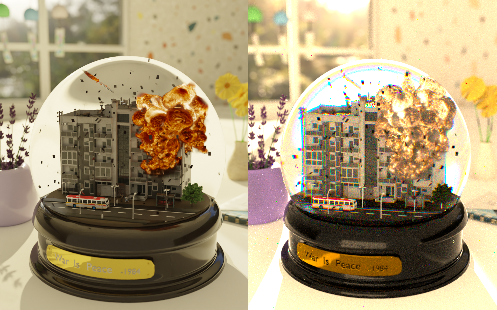
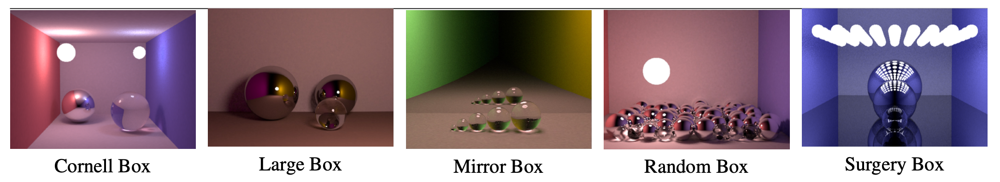
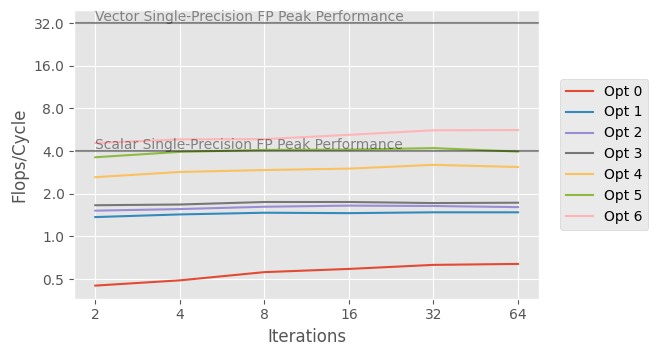
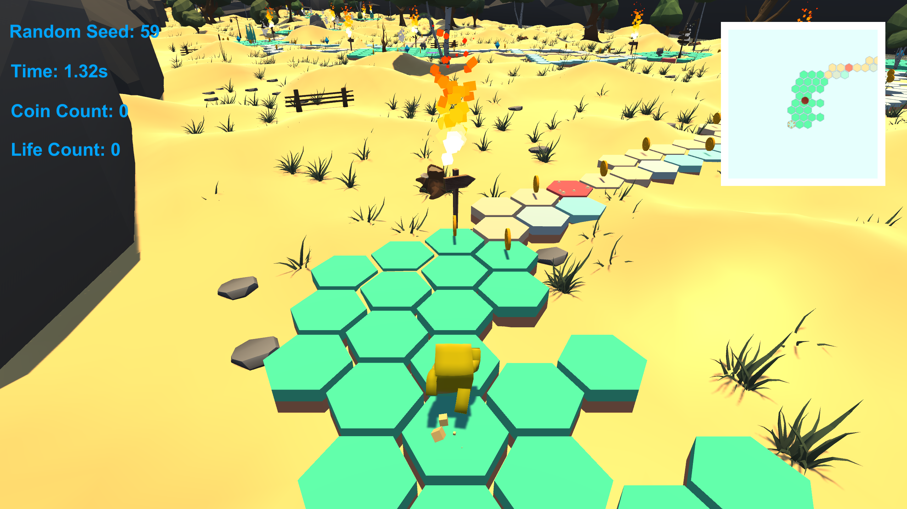
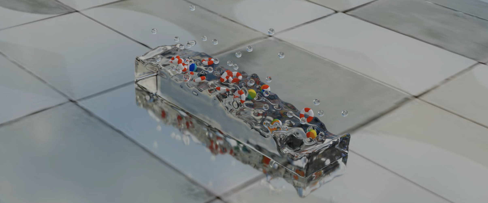

<!-- 


  
 -->

[Nori CPU Renderer](#nori-cpu-renderer)

[Stochastic Progressive Photon Mapping CPU Optimization](#stochastic-progressive-photon-mapping-cpu-optimization)

[Hexagon Running Game](#hexagon-running-game)

[Position Based Fluids](#position-based-fluids)

This webpage lists a rough description for each project. Please refer to the corresponding Github link for detailed documentation.

<a name="nori-cpu-renderer"/> 

Nori CPU Renderer
------

<i>Left: Blender &nbsp;&nbsp;&nbsp;&nbsp; Right: Nori</i>

This is my own offline physically-based renderer based on the educational ray tracing framework Nori 2, written in C++.

My renderer supports a wide range of rendering-related techniques, from light transport algorithms (**path tracing with MIS, volume rendering for heterogeneous and emissive medium, photon mapping with final gathering and caustics map**) to advanced material model (**microfacet BRDF and BSDF with GGX and visible normal sampling**), as well as components to improve visuals (**depth of field, environment map light source**).

Writing my own renderer is a lot of fun :)

[**Github Link**](https://github.com/Fiona730/Nori-CPU-Renderer)

<a name="stochastic-progressive-photon-mapping-cpu-optimization"/> 

Stochastic Progressive Photon Mapping CPU Optimization
------

 

In this project, as a group of four people, we implemented **stochastic progressive photon mapping** in C and performs multiple stages of CPU optimization. Due to the need of SPPM to store visible points in each iteration, this application is heavily memory-bound rather than compute-bound. The final result is a **fully-vectorized (SIMD) algorithm** with Intel intrinsics, and cache misses are minimized through changing data structure layout. It achieves up to a **22.69x** speedup over the baseline implementation.

[**Github Link**](https://github.com/Fiona730/SPPM-CPU-Optimization)

<a name="hexagon-running-game"/> 

Hexagon Running Game
------

This is a running game with running paths formed by hexagons, designed and made by myself with **Unity**. The project is constructed with the idea of **procedural content generation** in mind. Actually, everything in the scene is generated automatically based solely on a user input random integer, including the hexagon path as well as the plants, rocks and the terrain. In other words, changing the random seed will lead to a completely different parkour path and environment, which stimulates the player's interest in keeping playing the game.

[**Github Link**](https://github.com/Fiona730/Hexagon-Running-Game-Unity)

<a name="position-based-fluids"/> 

Position Based Fluids
------

As a group of three people, we implemented position based fluids method for fluid simulation in 3D space with **Taichi**, a high-performance parallel language wrapped in python. Object collision is also handled in our code to support objects contacting or inside the fluid.

In each frame, we construct fluid surface from simulated particle position data, then pass it into Blender for rendering; appending the result of multiple frames yields the simulation animation.

[**Github Link**](https://github.com/Fiona730/Position-Based-Fluids-Taichi)